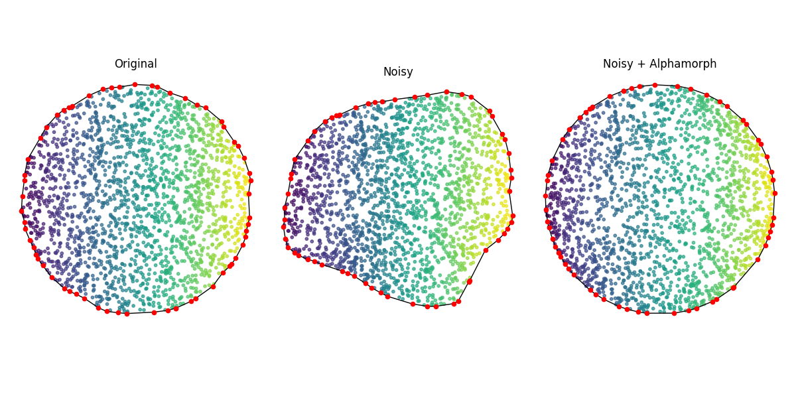

# Alphamorph

**alphamorph** is a Python package for non-rigid transformations of point clouds. Unlike the traditional usage of **registration** between a source and a target, alphamorph registers a source point cloud and a target **shape**, in this case a circle.

## Features
- **Point Cloud Transformation:** Given a noisy point cloud, apply a non-rigid transformation so it fits a shape
- **Distortion:** Introduce controlled noise to simulate distorted boundaries.
- **Alpha Shapes:** Extract the boundary of a point cloud using alpha shapes.
- **TPS Transformation:** Compute and apply thin-plate spline transformations to warp a point cloud.
- **Visualization:** Easily visualize the original, distorted, and transformed point clouds.

## Installation

You can install **alphamorph** via pip:

```bash
pip install alphamorph
```

Or install from source in editable mode:

````bash
git clone https://github.com/yourusername/alphamorph.git
cd alphamorph
pip install -e .
````

## Usage Example

Below is a simple example that demonstrates how to use **alphamorph** to transform a point cloud:

````python
import numpy as np
from alphamorph.geometry import generate_point_cloud, distort_point_cloud
from alphamorph.alpha import compute_alpha_shape
from alphamorph.apply import alphamorph_apply
from alphamorph.plotting import plot_point_cloud, create_color_list


np.random.seed(42)

# Generate an original point cloud and a distorted version
original_points = generate_point_cloud(num_points=2000)
color_list = create_color_list(original_points)
noisy_points = distort_point_cloud(original_points, noise_scale=0.2, num_bins=15)


# Compute alpha shapes and apply alphamorph transformation
alpha = 2.5  
_, original_hull_points = compute_alpha_shape(original_points, alpha)
_, reconstructed_hull_points = compute_alpha_shape(noisy_points, alpha)
new_points = alphamorph_apply(original_points, alpha=alpha)
new_points_hull_points = new_points  

# Plot
fig, axes = plt.subplots(1, 3, figsize=(12, 6))
plot_point_cloud(axes[0], original_points, 'Original', color_list=color_list, hull_points=original_hull_points)
plot_point_cloud(axes[1], noisy_points, 'Noisy', color_list=color_list, hull_points=reconstructed_hull_points)
plot_point_cloud(axes[2], new_points, 'Noisy + Alphamorph', color_list=color_list, hull_points=new_points_hull_points)
plt.tight_layout()
plt.savefig('alphamorph_example.png')
plt.show()
````

## Example Results




